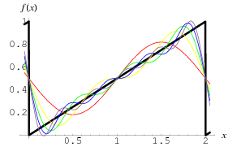
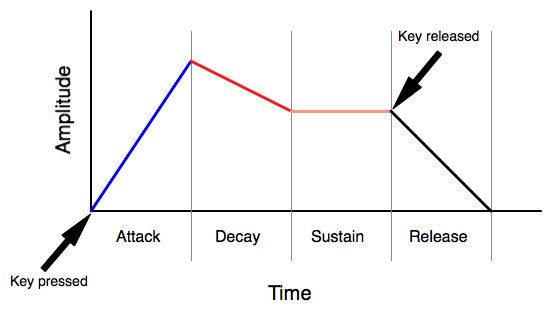

# Cynth

## Co je Cynth?

Cynth je programovatelný syntezátor zvuku, který pracuje s low-level zvukovými API [[1](#note-1-1)] a umožnujě práci v různých prostředích: Cynth je možné využít jako statickou i dynamickou knihovnu pro C++ [[2](#note-1-2)], nebo jako Python modul [[3](#note-1-3)], který zpřístupňuje většinu funkcionality z C++ knihovny.

---

<a id="note-1-1"></a>
`1:` Momentálně podporuje pouze WASAPI pro Windows.

<a id="note-1-2"></a>
`2:` V podobě `DLL` knihovny pro Windows.

<a id="note-1-3"></a>
`3:` V podobě `PYD` modulu pro Windows.

---

## Jak začít?

Pro rychlý start beze zdlouhavých blábolů této dokumentace se stačí podívat do příkladů použití v souboru `src/entry.cpp` pro C++ knihovnu a v `build/test.py` pro Python modul. Popisuji tam veškerou funkcionalitu Cynthu. Pro podrobnější detaily k jednotlivým prvkům čtěte dále.

## Jak kompilovat?

Kompiluji pomocí CMake. Osobně využívám kompilátor MinGW na Windowsu a editor Visual Studio Code a mám vše tomu přizpůsobeno. Pokud nevíte jak kompilovat s CMakem a máte podobný setup, stačí se řídit skripty `gen.bat` a `build.bat`. Pokud ne, pak můžou tyto skripty posloužit alespoň jako inspirace.

V souboru `CMakeLists.txt` jsou na začátku nastaveny možnosti kompilace. Vše k těmto možnostem je v souboru popsáno. Tady pouze shrnu:

Zatím je implementována varianta pouze pro Windows, tedy zvolte:

```CMake
set(CYNTH_OS "WIN")
```

Z API je implementováno pouze WASAPI, tedy zvolte:

```CMake
set(CYNTH_API "WASAPI")
```

Dále máte dvě možnosti:

```CMake
set(CYNTH_ENV "SHARED")
```

vytvoří DLL knihovnu. K použití DLL knihovny ji stačí linkovat při kompilaci vašeho programu a někam do vašeho projektu vložit Cynth headry z `inc/`. `__declspec` se přizpůsobí automaticky.

```CMake
set(CYNTH_ENV "PY")
```

vytvoří Python PYD modul. K použití modulu ho stačí importovat v Pythonu.

Pro export Python modulu používám knihovnu pybind11. V `CMakeLists.txt` jsou nastavené některé hodnoty, které je třeba změnit podle nastavení ve vašem počítači - umístění Python headrů a případně i Python executable.

Výsledné knihovny najdete ve složce `bin/`.

K použití Cynthu jako statické knihovny pro C++ umístěte zdrojové soubory a headry do vašeho projektu a pouze definujte makra `CYNTH_ENV_LIB` a `CYNTH_LIB_STATIC`.

## Co je syntéza zvuku?

Zvuk se dá popsat mnoha způsoby. Jedním z nich je hudební teorie. Různé kultury mají různou hudební teorii, ale většinou jde o podobný princip. Vyskytují se koncepty jako výška tónu, barva tónu, rytmus apod. Hudební teorie se většinou zabývá technikami, jak tyto koncepty skládat dohromady a tím tvořit něco, co lidskému uchu zní příjemně. Nezabývá se však původem těchto konceptů. Rozlišuje barvu zvuku např. klavíru a kytary, rozlišuje různé výšky tónů a popisuje je notami, pak jim přiřazuje i rytmus podle toho, jak dlouho znějí. Neodpovídá ale na otázky jako "Co je tón?", "Jak se liší kytara od klavíru?".

Toto však popisuje fyzika. Popisuje zvuk jako vlnu, která má tři základní parametry: frekvenci, amplitudu a vlnovou funkci. Frekvence, neboli počet opakování jedné periody za časový úsek, ovlivňuje výšku tónu. Amplituda, neboli rozkmit vlny, ovlivňuje hlasitost tónu. Vlnovou funkcí je myšlen tvar jedné periody. Tento tvar ovlivňuje barvu zvuku. Lidské ucho vnímá zvuk jako složené sinusoidy, tedy libovolnou zvukovou vlnu si rozloží na jednotlivé sinusoidy o různých amplitudách a frekvencích a právě toto složení různých vln je vnímáno jako barva zvuku. K tomu může posloužit matematický koncept - Fourierova řada, která umožňuje libovolnou funkci zapsat jakou součet sinusoid. Tento koncept využívá aditivní syntéza, která docílí určité barvy zvuku právě skládáním sinusoid. Tímto se však Cynth přímo nezabývá. Namísto skládání sinusoid se využívají již složené typické funkce jako sawtooth vlna, tvarem připomínající zuby pily. Na následujícím obrázku je zobrazena jedna perioda sawtooth vlny (černě) a složené sinusoidy z Fourierovy řady, které vnímá lidské ucho:



Další typické vlny jsou square a triangle:


Tyto typické vlny se často využívají při běžné syntéze zvuku, proto jsou v Cynthu předem dané. Není ale problém si nadefinovat vlastní vlnovou funkci pro dosažení specifického výsledku.

Každá vlna (kromě právě čisté sinusoidy) je tedy uchem vnímána jako složení více sinusoid. Tyto sinusoidy mají různé frekvence a amplitudy. Lidské ucho je schopno vnímat více složených vln, třeba z různých nástrojů, a rozložit si je na zvláštní vlny a tak rozpoznat tyto nástroje od sebe i přes to, že hrají zároveň. V případě rozkládání zmíněných vln (sawtooth apod.) je však jedna z těchto sinusoid dominantní natolik (svojí amplitudou), že ji lidské ucho vnímá jako ten základní tón a ty ostatní pouze jako tzv. alikvótní tóny, které tento základní tón pouze doprovázejí a ovlivňují jeho barvu, spíše než že by zněly jako zvláštní zvuky.

Závěrem je, že i když si člověk třeba zazpívá notu C, tak nezní pouze tato nota, ale i mnohé další z tzv. vyšších harmonických tónů. Dokonce lze znění těchto alikvótních tónů ovládat tak, že jsou opravdu slyšet jako zvláštní tóny. Toho využívá například hrdelní zpěv, kdy zpěvák zvívá zdánlivě několika hlasy zároveň. Hlavně nás ale zajímá to, že každý hudební nástroj vydává zvuk lehce jiným způsobem - používá struny, membrány, nebo jiné prostředky a tyto např. struny mohou být upevněné jiným způsobem a rozkmitány jiným způsobem. To vše ovlivňuje, jaké vzniknou alikvótní tóny a tedy jakou barvu bude tento nástroj mít.

To však není vše, co ovlivní zvuk tónu. Například klavír využívá jako svojí tzv. rezonanční skříň (prostor, ve kterém vniká, rezonuje a tak se i zesiluje zvuk) poměrně velký prostor, zatímco, kytara má rezonanční skříň mnohem menší a obě jsou značně různých tvarů. Toto hlavně omezuje některé frekvence vznikající ať už jako základní, nebo alikvótní tóny.

## Syntéza zvuku: Analogový přístup

V přírodě může být zdrojem zvuku struna, membrána, hlasivky apod. - cokoliv, co rozechvěje vzduch, tzv. oscilátor. První techniky syntézy zvuku (analogické) využívaly elektronických oscilátorů, tedy nekmitá vzduch, ale jde o nějakou vlnu v napětí/proudu elektřiny. Tato vlna pak ovládá fyzické kmitání reproduktoru, který slouží jako fyzická kmitající blána, která je právě zdrojem reálného zvuku.

### Tone generator

Říkejme zdrojovému oscilároru tone generator. Na cestě od tone generatoru k reproduktou se vlna modifikuje různými dalšími elektronickými přístroji. Například tzv. lfo, envelope, filter, compressor apod.

### LFO

LFO je zkratkou pro low frequency oscillator, tedy jde opět o obyčejný oscilátor, akorát osciluje na nižších frekveních. Tone generator osciluje na frekvencích cca 20Hz-20kHz, tedy frekvencích, které lidské ucho vnímá jako tón. LFO osciluje na mnohem nižších frekvencích (řádově max. desítky Hz) a jeho účelem je ovládat jiné přístroje. Může například ovládat amplitudu tone generatoru a tak vytvořit to, čemu hudební teorie říká vibrato.

### Envelope

Vrátím se k pohledu na hudební nástroje. Když zazní tón na klavíru, začne znít ihned hlasitě (s vysokou amplitudou) a postupně se stiší (amplituda se sníží), zatímco třeba na houslích je možné průběh amplitudy ovládat smyčcem. Envelope dělá právě toto. Podobně jako LFO, ovládá envelope např. amplitudu tone generátoru nějakou funkcí, která začíná v okamžiku, kdy tone generator dostane signál, že má začít "hrát", tedy například kdy se stiskne tlačítko připojeného elektronického nástroje. Po puštení tlačítka se dostává funkce do poslední fáze. Průběh této funkce se standardně popisuje čtyřmi parametry:

* `attack`: Čas, za který amplituda stoupne z nuly na maximum od okamžiku stisku tlačítka.
* `decay`: Čas, za který amplituda potom klesne na amplitudu udanou jako `sustain`.
* `sustain`: Amplituda na kterou se klesne po oběhnutí `decay` času.
* `release`: Čas, za který amplituda klesne na nulu od okamžiku puštění tlačítka.



### Ostatní

Filter řeší omezení určitých frekvencí, jak jsem popisoval na příkladu rezonanční skříně. Zjednodušeně řečeno funguje opravdu jako síto - určité frekvence nepropouští. Jak ale konktrétně ovlivňuje vlnovou funkci v konkrétním okamžiku je ale složitější popsat, jde o poměrně komplikovaný matematický koncept.

Compressor nějakým způsobem omezuje amplitudu signálu. Většinou si rozdělí amplitudy nějakou mezí a tlumí třeba ty, co tuto mez přesahují, nebo naopak.

## Syntéza zvuku: Digitální přístup

Analogový syntezátor pracuju se spojitým signálem. Jakýkoliv pokus o převedení konceptu syntezátoru do digitálního prostředí samozřejmě musí řešit převedení tohoto spojitého signálu na digitální, tedy diskrétní signál.

Čas se rozdělí na diskrétní úseky, kterým odpovídá tzv. sample - jednotka digitálního signálu obsahující informaci o amplitudě v podobě diskrétní hodnoty. Toto rozdělení času udává veličina `sample rate`, která odpovídá počtu samplů za sekundu. Přesnost amplitudy udává veličina `bit depth`, která odpovídá počtů bitů na sample.

Standardní hodnoty `bit depth` jsou: zastaralých 8 bitů, běžných 16 bitů pro CD kvalitu, 24 bitů pro WAV kvalitu a často i 32 bitů pro přímou práci se zvukem, či pro nějaké nestandardní formáty. Většinou se amplituda reprezentuje jako signed integer v rozmezí od minimální po maximální hodnotu vyjádřitelnou s dostupným počtem bitů. V některých případech jde o unsigned integer a někdy (hlavně při přímé práci se zvukem) dokonce i IEEE 32 bitový floating point (v ojedinělých případech i 64 bitový).

Ovladač zvukové karty přijímá proud těchto samplů v určitém formátu, co podporuje a v kterém momentálně operuje. Je jen na operačním systému (případně na programátorovi, pokud pracuje s ovladači přímo [[1](#note-2-1)]), aby převedl formát aktuálně přehrávaného zvuku na formát ovladačů. Tento proud dat se přenáší v podobě bufferu: Přehrávající program se domluví s ovladačem na tom, kde v paměti od něj očekává kus samplů, kolik jich očekává a kdy bude připraven další buffer na další samply.

Ovladač pak řeší převedení získaného digitálního signálu na analogový a jím rozkmitá reproduktor. Samozřejmě zobrazení `analog -> digital` není bijekce a tedy jeho inverzní zobrazení můžeme pouze odhadnout. Z tohoto odhadu plyne zkreslení zvuku, ale tímto se Cynth samozřejmě nezabývá, jde o práci ovladače.

Při digitální syntéze se stále využívají všechna zmíněná analogová zařízení, akorát v podobě nějaké digitální abstrakce.

---

<a id="note-2-1"></a>
`1:` Momentálně pracuje Cynth s WASAPI pouze v shared mode, což znamená, že předává data nikoliv ovladači přímo, ale sound enginu (v jeho formátu), který signál ze Cynthu mixuje spolu s ostatními systémovými zvuky před předáním ovladačům. Toto umožňuje využívání Cynthu nepřetržitě s ostatními programy a navíc to řeší převod formátu, avšak na druhou stranu to omezuje minimum latence (opoždění signálu) podle nastavení sound enginu.

---

## Stručně o struktuře projektu

Projekt je stavěn podle běžných konvencí pro C++. Interface (headry s `.hpp` příponou) najdete ve složce `inc/`, implementaci (zdrojové soubory s `.cpp` příponou) ve složce `src/`. Většina kódu je typické OOP. Některé volné funkce a statické třídy obsahující základní funkce jsou přímo ve složce `src/` resp. `inc/`, zbytek je však členěn do tříd, které poskytují abstrakce různých konceptů na různých úrovních a tyto třídy jsou rozřazeny v různých podsložkách podle jejich kontextu. Headry a jim odpovídající zdrojové soubory se umístěním liší pouze složkou `src/` a `inc/`, dále jsou ve stejných podsložkách. Až na pár výjimek jeden soubor odpovídá jedné třídě.

## Cynth::API

Nejnižší úrovní práce Cynthu je interakce se zvukovým API. Cílem je tuto úroveň maximálně "zapouzdřit" a skrýt před koncovým uživatelem.

### WASAPI

Interakce s WASAPI probíhá skrze COM (component object model). COM je již poměrně stará technologie a zachovává si i dnes starší "céčkový" postup práce. COM poskytuje funkce k získání pointeru na požadovaný interface - ekvivalent třídy. Tento interfacy se musí po použití "uklidit" a samozřejmě je třeba řešit i všechny problémy spojené s využitím pointerů. Navíc COM nevyužívá výjimky (exceptions), nýbrž chybové kódy, které je třeba vždy ověřovat a převést na vhodnou výjimku v rámci Cynthu.

K tomuto účelu je vytvořena šablona base třídy:

```C++
template<typename interface_t> class Interface
````

Je umístěna v `api/wasapi/interface.*pp`.

Konstruuje se z pointeru na COM interface, který se udává jako parametr šablony `interface_t`. Objekt třídy `Interface` pak obsahuje vlastnost `interface_t* ptr_instance`, což je právě pointer na jeho COM interface. `Interface` má overloadovaný operátor:

```C++
interface_t* operator->()
```

který poskytuje zkratku pro přístup k jeho COM interface. Ve většině případů však ani takový přístup není potřeba. U jednotlivých tříd dědícíh z `Interface` jsou dodefinovány metody pro základní metody z jejich COM interfaců potřebné pro funkci Cynthu, které řeší práci s COMem bezpečněji.

Některé z používaných COM interfaců jsou problematické při kopírování. Proto je u base třídy `Interface` zakázaný copy constructor a naopak explicitně vyjádřený move constructor.

Destruktor třídy `Interface` zařídí zavolání COM metody `Release`, která příslušný COM interface "uklidí".

Postup práce s WASAPI je vidět ve třídě `Setup` umístěné v `api/wasapi/setup.*pp`. Tato třída vytvoří potřebné COM interfacy a zavolá jejich metody potřebné k získání informace o aktuálním nastavení systému.

### Obecně

Po úspěšném nastavení se pro aktivní koncová zařízení vytvoří třída `Device` umístěná v `api/wasapi/device.*pp` pro WASAPI, ale přístupná i obecně jako `api/device.hpp` (stejně jako `api/setup.hpp`). Tato třída obsahuje vlastnosti i metody specifické pro konkrétní API, ale i obecné vlastnosti a metody, které by neměly záviset na API. Tato nezávislost na API se bude dolaďovat po přidání dalších API. `Device` obsahuje především vlastnosti popisující PCM formát, který API očekává a metody poskytující zápis dat do bufferu.

## Cynth::PCM

PCM (pulse code modulation) je technika digitální syntézy zvuku, kterou jsem popsal v úvodu o syntéze zvuku. V rámci Cynthu jde o meziúroveň zapouzdření.

Ve složce `pcm/` najdete abstrakce `Sample` a `Buffer`:

### Sample

Jak bylo zmíněno, sample může být různě velký, většinou jde o násobky 8 bitů, ale může být i 24 bitový, což nelze jednoduše popsat žádným typem. Předpokládám, že `bitdepth` nepřesáhne 32 bitů, tedy pracuji interně s 32 bitovým integerem (`long`). `Sample` pak obsahuje `std::vector` bytů (`char`) délky odpovídající zadanému `bitdepth` a má overloadované operátory přiřazení:

```C++
Sample& operator=(long value);
Sample& operator=(unsigned long value);
Sample& operator=(float value);
Sample& operator=(double value);
```

které řeší převedení nějakého typu na vektor jednotlivých bytů. `std::vector` zachovává svá data uložená spojitě a dá se tedy jednoduše v konstantním čase převést na klasické "céčkové" pole.

Momentálně Cynth pracuje pouze s WASAPI v shared mode. To znamená, že zvukový signál se posílá do audio engine, který vždy pracuje s 32 bitovým IEEE floatem a nezávisí na koncovém zařízení. Cynth pracuje interně se 32 bitovým IEEE floatem také. Do budoucna bude třeba přidat převod na jiné formáty, čemuž jako podklad poslouží právě abstrakce Samplu.

### Buffer

`Buffer` pak obsahuje vektor bytů, který odpovídá poli samplů, které se do něj vloží pomocí overloadovaného operátoru:

```C++
Buffer& operator<<(Sample sample)
```

[[1](#note-3-1)] (TODO)

Následně při zápisu do reálného zápisu opět není problém tento buffer převést na "céčkové" pole. K tomuto slouží metody:

```C++
void copyTo(unsigned char* ptr_buffer, std::size_t size)
void moveTo(unsigned char* ptr_buffer, std::size_t size)
    // Navíc vymaže obsah a resetuje velikost na 0.
```

---

<a id="note-3-1"></a>
`1:` Overloadování operátoru `operator<<` je v Cynthu použito poměrně často. Nejde o ekvivalent bitového posunu, ale spíše stream operatoru, jako u `std::cin` a `std::cout`. Používá se pak pro napojování přístrojů, jak budu popisovat dále.

---

### Vlnová funkce

V analogovém syntezátoru zvukovou vlnu reprezentuje vlna proudu/napětí, kterou vysílá jedno zařízení do dalšího, které ji dále modifikuje. V digitálním syntezátoru se toto dá napodobit pomocí eventů. Cynth však eventy využívá minimálně. Oscilátor je v kontextu Cynthu pouze třída obsahující nějakou vlnovou funkci. Tato funkce je implementována jako `std::function`.

Základem je šablona base třídy:

```C++
template<typename output_t = float> class TimeFunction;
```

což je funktor, tedy wrapper funkce s overloadovaným operátorem:

```C++
virtual CYNTH_EXPORT output_t operator() (double offset) const;
```
[[1](#note-4-1)]

Dále má overloadované operátory:

```C++
CYNTH_EXPORT TimeFunction<output_t>& operator=(def_t def);
CYNTH_EXPORT TimeFunction<output_t>& operator<<(def_t def);
```

Přiřazení `=` má funkci nastavení předpisu funkce. Operátor `<<` má stejnou funkci. Umožňuje alternativu pro Python, kde operátor přiřazení není možné overloadovat a navíc logicky doplňuje konvenci Cynthu s tímto operátorem k zapsání/přiřazení něčeho do něčeho jiného.

Předpis funkce se udává pomocí `std::function` - v praxi lambda funkcí. Příklad naleznete v `entry.cpp`.

Předpis je pak uložen jako:

```C++
using def_t = std::function<output_t(double)>;
def_t def;
```

Tedy jde o funkci přijímacící parametr typu `double` a vracející libovolný vybraný typ. Vstup reprezentuje čas, který se interně popisuje doublem, zatímco výstup může být cokoliv. Momentálně se využívá pouze verze s výtupem typu `float` - třída `WaveFunction`, kterou rozeberu dále.

Při následujícím předávání této funkce dalším zařízením se opravdu předá pouze tato funkce a výsledná funkce, ze které se zapisuje do bufferu, je jen složením funkcí na cestě k výstupu. Takto všechna zařízení komunikují naprosto staticky bez zádných eventů. I přes to je ale možné bez problémů eventy zakomponovat, jelikož se na tyto funkce odkazuje pointerem. [[2](#note-4-2)]

Jedinou součástí třídy `TimeFunction`, která se ovládá eventy je:

```C++
double start;
```

Což je počátečný offset funkce (hodnota která se odečte od offsetu z inputu), který se v případě spuštění nějakého eventu nastaví na aktuální čas a funkce takto začne "hrát" od začátku. Toto se využívá v `Envelope` (což rozeberu dále) a je možné do budoucna to využít na synchronizaci. (TODO)

---

<a id="note-4-1"></a>
`1:` Makro `CYNTH_EXPORT` je záležitost specifická pro Microsoft. Expanduje na `__declspec(dllexport)` při buildu DLL knihovny pro zpřístupnění této metody v knihovně a na `__declspec(dllimport)` při použití tohoto headru již v cílovém programu, aby měl kompilátor jasno, že definici nenajde v lokálních zdrojích, ale v DLL knihovně.

<a id="note-4-2"></a>
`2:` V interaktivním interpreteru Pythonu je možné importovat modul Cynthu a pracovat s ním "živě", tedy spustit playback a zatímco uživatel mění vlastnosti aktuálních zařízení se tyto změny se projevují ihned bez restartu playbacku.

---

## Cynth::Rack

Rack většinou označuje skříň, do které se montují různé hudební přístroje, například právě do syntezátoru. Ve složce `rack/` tedy najdete abstrakce takových zařízení. Jde o poslední úroveň zapouzdření v rámci Cynthu [[1](#note-5-1)]. Samotný koncept racku plánuji do Cynthu zakomponovat v budoucnu, avšak momentálně jde jen o logické členění projektu. Implementace těchto abstrakcí se snaží napodobit reálné analogové přístroje alespoň způsobem vzájemného napojení a interakce navenek.

### Komponenty - porty

Kromě samotných zařízení Cynth využívá abstrakci jakýchsi konektorů - tvz. portů. Prvním typem portu je `TransmitterPort`. Je to vysílací port, neboli output konektor, zkrátka něco, co umožní dalším zařízením získat data ze zařízení, kterému daný `TransmitterPort` náleží. Obsahuje pointer na vlnovou funkci:

```C++
const WaveFunction* ptr_wave_function;
```

který odkazuje na vlnovou funkci příslušného zařízení. Podle konvence Cynthu se tato funkce přiřadí overloadovaným operátorem:

```C++
ReceiverPort& operator<<(const TransmitterPort& port);
```

K samotnému získání hodnoty vlnové funkce v daném čase slouží operátor:

```C++
float operator()(double offset) const;
```

Opakem je pak `ReceiverPort`, který obsahuje pointer na `TransmitterPort`:

```C++
const TransmitterPort* ptr_transmitter_port;
```

který se opět nastaví operátorem:

```C++
CYNTH_EXPORT ReceiverPort& operator<<(const TransmitterPort& port);
```

který je dostupný v knihovně a tedy uživatel má možnost připojit `TransmitterPort` jednoho zařízení k `ReceiverPort`u jiného. (TODO: Moved CYNTH_EXPORT. Check if still works.)

Hodnota vlnové funkce se pak získá operátorem:

```C++
float operator()(double offset) const;
```

Dále k vyslání eventu jsou `EventTransmitterPort` a `EventReceiverPort`. (TODO: Not implemented yet.)

### Input zařízení

Třída `InputDevice` je base třídou pro všecha zařízení, co slouží jako input pro jiná zařízení. Mají jeden `TransmitterPort`:

```C++
TransmitterPort output_port;
```

který je veřejně přístupný.

### Output zařízení

Třída `OutputDevice` je base třídou pro většinu zařízení, co jsou schopna příjmout jiná zařízení jako jejich input. "Pro většinu", jelikož některým zařízením nestačí jeden input a jsou nějak specifická. `InputDevice` i `OutputDevice` je tedy pouze pokus o sjednocení formátu zařízení v rámci možností alespoň pro jednodušší zařízení.

`OutputDevice` obsahuje jeden veřejně dostpný `ReceiverPort`:

```C++
ReceiverPort input_port;
```

Má pro jednoduchost overloadovaný operátor, který přiřadí daný `TransmitterPort` rovnou jeho `input_port`u:

```C++
CYNTH_EXPORT ReceiverPort& operator<<(const TransmitterPort& port);
```

### Oscilátor

Třída `Oscillator` dědí pouze z `InputDevice` i přes to, že umí příjmout i input. Jde však o komplexnější zařízení.

Obsahuje dva input porty:

```C++
ReceiverPort freq_port;
ReceiverPort amp_port;
```

které jsou veřejně dostupné a uživatel na ně může manuálně napojit nějaké input zařízení, které pak moduluje frekvenci, či amplitudu.

Obsahuje jeho původní vlnovou funkci:

```C++
WaveFunction raw_function;
```

a modulovanou funkci:

```C++
WaveFunction mod_function;
```

která je definována v konstruktoru jako:

```C++
this->mod_function = [this](float offset) -> float {
    return
        this->amp_port(offset)
        * this->raw_function(offset * this->freq_port(offset));
};
```

Jde tedy o původní funkci s upravenou amplitudou a frekvencí.

Uživateli jsou přístupné tři konstruktory:

```C++
Oscillator(
    float freq,
    float amp,
    freq_type_t freq_type);
```

který nastaví konstantní frekvenci, amplitudu a defaultně jako vlnovou funkci nastaví sinusoidu.

```C++
Oscillator(
    WaveFunction func,
    float freq,
    float amp,
    freq_type_t freq_type);
```

který příjme uživatelem nadefinovanou vlnovou funkci.

```C++
Oscillator(
    wave_func_t func,
    float freq,
    float amp,
    freq_type_t freq_type);
```

který příjme enum `wave_func_t` označující jednu ze základních vlnových funkcí.

Parametr `freq_type_t` je enum označující jednotku frekvence. [[2](#note-5-2)]

Jelikož frekvence i amplituda oscilátoru je řízena vlnovou funkcí, k nastavení konstantní hodnoty je třeba konstantní funkce, kterou vysílají vlastní `TransmitterPort`y:

```C++
TransmitterPort freq_transmitter;
TransmitterPort amp_transmitter;
```

### MIDI zařízení

Neimplementováno.

---

<a id="note-5-1"></a>
`1:` Uživatel však nemá mít ani k těmto zařízením přímý přístup, uživatelsky dostupná zařízení jsou umístěna ve zvláštní složce.

<a id="note-5-2"></a>
`2:` Momentálně je implementována pouze frekvence v Hz. Plánuji implementovat relativní frekvenci podle zadaného tempa a jednodušší způsob zápisu frekvencí jednotlivých not. K tomuto má také sloužit `ConversionFunction`. V aktuální verzi jsou výskyty této třídy nepoužity.

---

## Cynth::UserLibrary

Úplným závěrem těchto vrstev abstrakcí je `UserLibrary` - namespace obsahující prvky z `PCM` a `Rack` které mají být přístupné koncovému uživateli.

### WaveFunction

Jde pouze o konkrétní podtřídu šablony `TimeFunction`. Význam byl již popsán.

### WaveFs

Jde o jakousi "knihovnu" základních vlnových funkcí k jednoduchému použití bez manuálního definování. Některá zařízení obsahují vlastní instanci WaveFs. Kromě zdroje základních funkcí ji využívají jako kontejner vlastních specifických funkcí, jako například konstantní funkce frekvence a amplitudy v oscilátoru.

### SequenceElement

Jde o prvek sekvence - posloupnosti tónů. Tón má vlastní délku frekvenci a amplitudu. Uživatel vytvoří tento prvek konstruktorem:

```C++
SequenceElement(
    double duration,
    float amp = 0,
    float freq = 0);
```

### SequenceFunction

Sekvence obsahuje prvky popsané výše. Tyto prvky se do sekvence přidávají tradičním operátorem:

```C++
SequenceFunction& operator<<(SequenceElement element);
```

Je možné i "konkatenovat" celé sekvence:

```C++
SequenceFunction& operator<<(SequenceFunction f);
```

Dále je možné opakovat sekvenci `n`-krát:

```C++
SequenceFunction& operator*=(int n);
```

### Envelope

Nedokončeno.

### Hub

Slouží ke spojování "signálů" více zařízení. Uživatel vytvoří instanci konstruktorem:

```C++
Hub(comp_type_t comp_type = comp_type_t::ADD);
```

ve kterém zvolí jednu ze dvou hodnot enumu `comp_type_t`:

* `ADD`: Aditivní spojení funkcí.
* `MULTIP`: Multiplikativní spojení funkcí.

`ADD` je vhodné pro spojení více paralelních "tracků", neboli "nástrojů". `MULTIP` zase pro spojení efektů, například kdy několik přístrojů zároveň ovládají nějakou vlastnost oscilátoru. U `ADD` je třeba si dát pozor, aby nedošlo k přetečení - tzv. clipping, což se stává ve všech syntezátorech, kdy hlasitost nekontrolovaně přeroste kapacitu výstupního zařízení. K zamezení tohoto efektu slouží kompresor, který v Cynthu zatím není implementován.

### LFO

Jde pouze o konkrétní podtřídu třídy `Oscillator`. Význam byl popsán již v úvodu. Momentálně jediný rozdíl je v defaultní jodnotce frekvence, avšak jak již bylo zmíněno, jednotky frekvence nejsou zatím implementovány.

### Sequencer

`Sequencer` je zařízení podobné oscilátoru s tím rozdílem, že přehrává nikoliv jednoduchou funkci, ale více funkcí odpovídajících frekvenci a amplitudě tónů - tedy jde o diskrétní hodnoty.

Na `Sequencer` je možné napojit `SequenceFunction` popsanou výše tradičním operáorem:

```C++
Sequencer& operator<<(SequenceFunction f);
```

`Sequencer` pak obsahuje dva veřejně přístupné porty:

```C++
TransmitterPort freq_port;
TransmitterPort amp_port;
```

které se pak dají napojit na další zařízení.

V plánu mám zakomponovat i event porty pro délku tónu, které pak budou ovlivňovat envelope.

### Tone Generator

Jde pouze o konkrétní podtřídu třídy `Oscillator`. Význam byl popsán již v úvodu.

### SoundCard

`SoundCard` je abstrakcí výtupního zařízení. Použitím tohoto zařízení se uživatel dostane nejblíže úrovni low level práce se zvukem.

`SoundCard` dědí z `Input` device. Aby výsledek celé syntézy byl přehrán, uživateli stačí napojit tato zařízení (přes Huby) do `SoundCard` pomocí operátoru `<<` a spustit metodu `SoundCard::play()`.

Tato metoda se spustí paralelně jako `std::thread`, tedy při playbacku je možné napojená zařízení modifikovat. SoundCard pracuje přímo se zvukovým API (resp. přes abstrakci v Cynthu).

Pro zastavení playbacku pak stačí zavolat metodu `SoundCard::Stop()`.

Pro informaci o aktuálním nastavení formátu slouží metoda `SoundCard::printProperties()`.